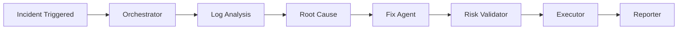

# Resolvix AI Architecture Documentation

## System Flow



## Agent Architecture

### 1. Orchestrator Agent
- **File**: `src/agents/orchestratorAgent/orchestrator.agent.ts`
- **Purpose**: Workflow coordination
- **Uses**: Direct Qwen client (qwen.client.ts)

### 2. Log Analysis Agent
- **File**: `src/agents/log-analysisAgent/logAnalysis.agent.ts`
- **Purpose**: Extract errors, build timeline, identify patterns
- **Tools**: extractErrors, buildTimeline, groupLogs, extractAffectedServices, dependencyMapper

### 3. Root Cause Agent
- **File**: `src/agents/root-causeAgent/rootCouse.agnte.ts`
- **Purpose**: Identify probable root cause
- **Uses**: Evidence from log analysis

### 4. Fix Agent
- **File**: `src/agents/fixAgent/fixAgent.agent.ts`
- **Purpose**: Generate remediation recommendations
- **Tools**: searchFixPlaybook, searchRunbook, configurationReader, configurationDiff, serviceInventory

### 5. Risk Validator Agent
- **File**: `src/agents/risk-validatorAgent/riskValidator.agent.ts`
- **Purpose**: Validate remediation safety
- **Tools**: approvalPolicy, maintenanceWindow, impactAssessment, missingValidation

### 6. Executor Node
- **File**: `src/langGraph/nodes/executor.node.ts`
- **Purpose**: Execute approved commands

### 7. Reporter Node
- **File**: `src/langGraph/nodes/reporter.node.ts`
- **Purpose**: Generate incident report

## Tool Architecture

### Fix Agent Tools (5)
```
src/tools/fixAgentTools/
├── toolExecutors/
│   ├── searchFixPlaybook.function.ts
│   ├── searchRunbook.function.ts
│   ├── configurationReader.function.ts
│   ├── configDiff.function.ts
│   └── serviceInventory.function.ts
└── toolWrappers/
    ├── searchFixPlaybookToolWrapper.ts
    ├── searchRunbookToolWrapper.ts
    ├── configurationReaderToolWrapper.ts
    ├── configDiffToolWrapper.ts
    └── serviceInventoryToolWrapper.ts
```

### Log Analyzer Tools (5)
```
src/tools/logAnalyzerAgentTools/
├── toolExecutors/
│   ├── extractErrors.ts
│   ├── buildTimeline.ts
│   ├── groupLogs.ts
│   ├── extractAffectedServices.ts
│   └── dependencyMapper.ts
└── toolWrappers/
    ├── extratErrorToolWraper.ts
    ├── buildTimelinetoolwrapper.ts
    ├── groupedLogToolWrapper.ts
    ├── extractAffectedServiceToolWrapper.ts
    └── dependencyMapperToolWrapper.ts
```

### Risk Validator Tools (4)
```
src/tools/riskValidatorTools/
├── toolExecutors/
│   ├── approvalPolicy.function.ts
│   ├── maintenanceWindow.function.ts
│   ├── impactAssessment.function.ts
│   └── missingValidation.function.ts
└── toolWrappers/
    ├── approvalPolicyToolWrapper.ts
    ├── maintenanceWindowToolWrapper.ts
    ├── impactAssessmentToolWrapper.ts
    └── missingValidationToolWrapper.ts
```

## AI Integration

```
src/ai/qwen/
├── qwen.client.ts      # Direct OpenAI-compatible client
├── qwen.langchain.ts   # LangChain model wrapper
├── qwen.config.ts      # Configuration settings
└── index.ts
```

## LangGraph Workflow

```
src/langGraph/
├── graph/
│   └── workflow.graph.ts    # Main workflow orchestration
├── nodes/
│   ├── orchestrator.node.ts
│   ├── logAnalysis.node.ts
│   ├── rootCause.node.ts
│   ├── fix.node.ts
│   ├── riskValidator.node.ts
│   ├── executor.node.ts
│   └── reporter.node.ts
└── state/
    └── workflow.state.ts    # Shared state annotations
```

## State Management

Type definitions in `src/types/`:
- `workflow.types.ts` - Workflow interfaces
- `orchestrationAgent.type.ts` - Orchestrator types
- `logAnalyzer.type.ts` - Log analyzer types
- `rootCouseAgent.types.ts` - Root cause types
- `fixAgent.types.ts` - Fix agent types
- `riskAgent.types.ts` - Risk validator types

## Services

```
src/services/
├── agentsServices/
│   ├── orchestratorAgentService/
│   ├── logAnalyzerService/
│   ├── rootCauseAgentService/
│   ├── fixAgentService/
│   └── riskValidationAgentService/
├── incidentSimulatorServices/
│   ├── db-failure.service.ts
│   ├── memory-leak.service.ts
│   ├── api-500-error.service.ts
│   ├── deployment-failure.service.ts
│   ├── cpu-spike.service.ts
│   └── index.ts
└── agentExecutionServices/
```

## Controllers & Routes

```
src/controllers/
├── incidentSimulatorController/
│   ├── db-failure.controller.ts
│   ├── memory-leak.controller.ts
│   ├── api-500-error.controller.ts
│   ├── deployment-failure.controller.ts
│   ├── cpu-spike.controller.ts
│   └── index.ts
└── auth.controller.ts

src/routes/
├── incident-simulation.routes.ts
├── auth.routes.ts
└── index.ts
```

## Models & Config

```
src/models/
├── user.model.ts
├── log.model.ts
├── report.model.ts
├── incident.model.ts
├── audit.model.ts
└── agentExecution.model.ts

src/config/
├── db.ts
├── email.ts
├── rateLimiter.ts
├── validateEnv.ts
├── approvalPolicyTool.config.ts
└── maintaincepolicy.config.ts
```