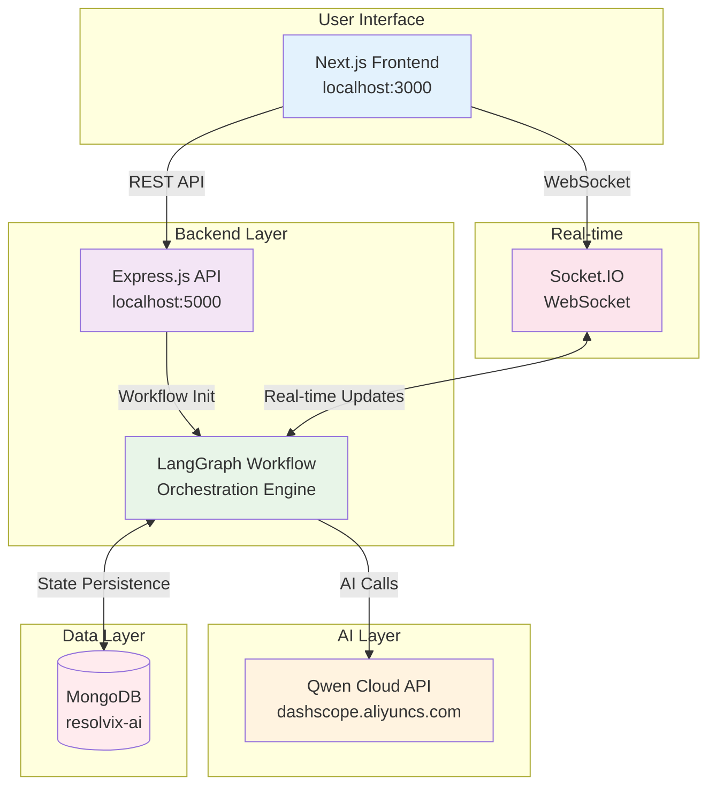
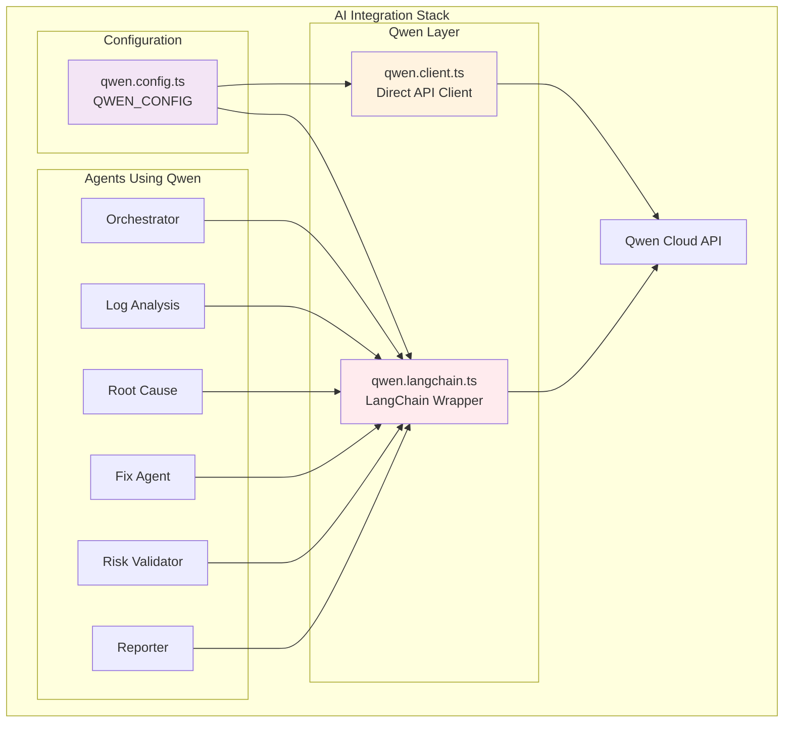
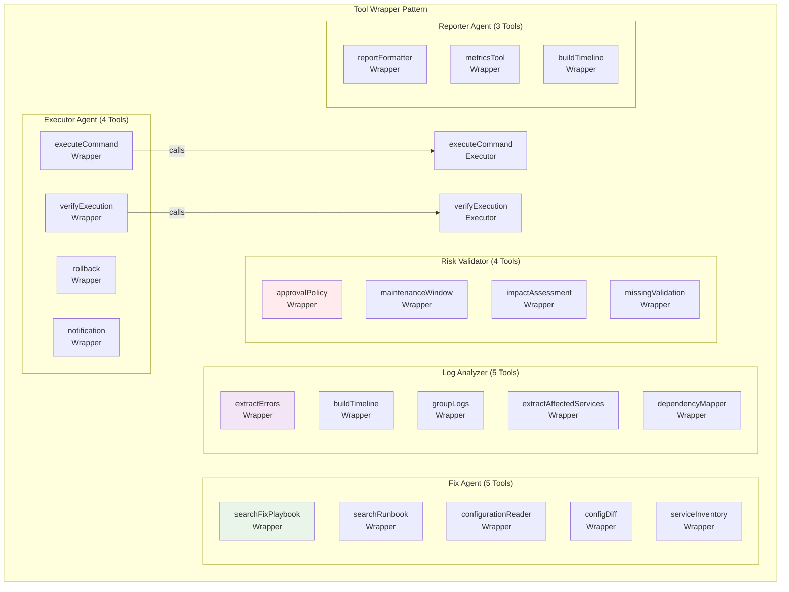
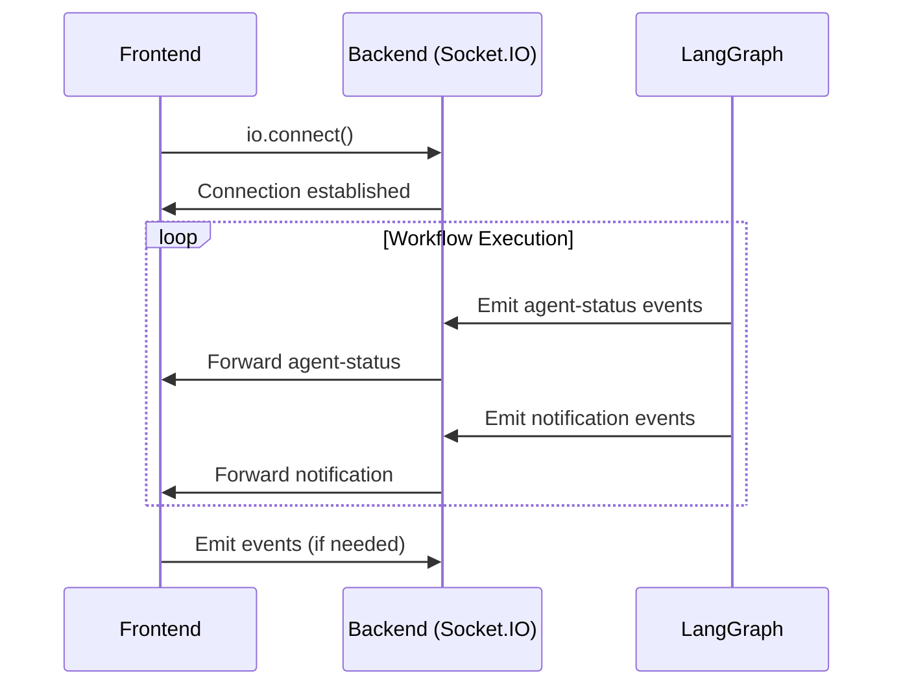
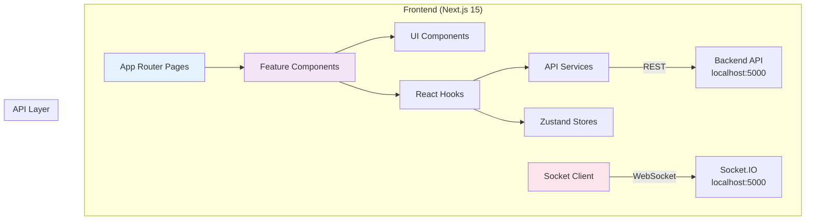
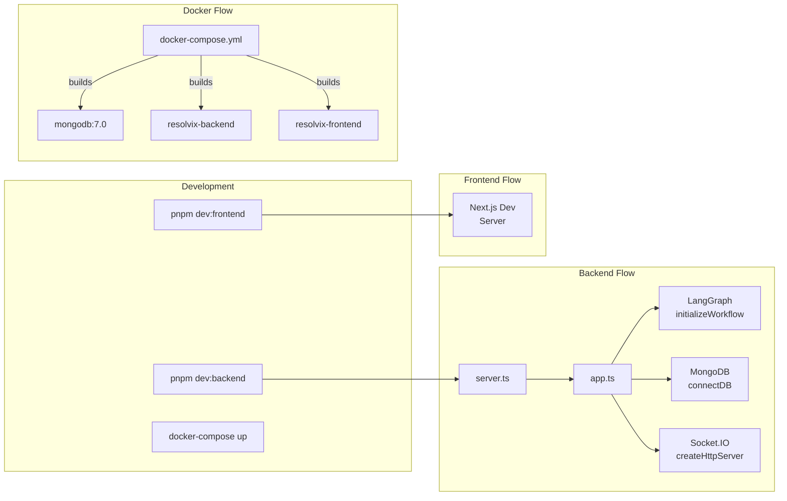

# Resolvix AI Architecture Documentation

## System Overview



## Agent Architecture

### Agent List

| #   | Agent          | File                                                    | Purpose                                  |
| --- | -------------- | ------------------------------------------------------- | ---------------------------------------- |
| 1   | Orchestrator   | `src/agents/orchestratorAgent/orchestrator.agent.ts`    | Workflow coordination                    |
| 2   | Log Analysis   | `src/agents/log-analysisAgent/logAnalysis.agent.ts`     | Extract errors, build timeline, patterns |
| 3   | Root Cause     | `src/agents/root-causeAgent/rootCouse.agnte.ts`         | Identify probable root cause             |
| 4   | Fix Agent      | `src/agents/fixAgent/fixAgent.agent.ts`                 | Generate remediation recommendations     |
| 5   | Risk Validator | `src/agents/risk-validatorAgent/riskValidator.agent.ts` | Validate remediation safety              |
| 6   | Executor       | `src/langGraph/nodes/executor.node.ts`                  | Execute approved commands                |
| 7   | Reporter       | `src/langGraph/nodes/reporter.node.ts`                  | Generate incident report                 |

### Workflow Nodes

```
src/langGraph/nodes/
├── orchestrator.node.ts      # Entry point - workflow initialization
├── logAnalysis.node.ts       # Log extraction and analysis
├── rootCause.node.ts         # Root cause identification
├── fix.node.ts               # Fix recommendation generation
├── riskValidator.node.ts     # Risk assessment and validation
├── approvalRouter.node.ts    # Approval routing decision
├── executor.node.ts          # Command execution
├── reporter.node.ts          # Report generation
└── complete.node.ts          # Workflow completion
```

## Qwen Cloud Integration



## Database Schema

```
src/models/
├── user.model.ts             # User authentication
├── incident.model.ts         # Incident records
├── log.model.ts              # Log entries
├── report.model.ts           # Generated reports
├── agentExecution.model.ts   # Agent execution tracking
└── audit.model.ts            # Audit trail
```

### Incident Model Fields

| Field           | Type   | Description                  |
| --------------- | ------ | ---------------------------- |
| title           | String | Incident title               |
| description     | String | Incident description         |
| severity        | Enum   | critical, high, medium, low  |
| status          | Enum   | open, in_progress, resolved  |
| detectedAt      | Date   | Detection timestamp          |
| rootCause       | String | Identified root cause        |
| fixSummary      | String | Applied fix summary          |
| executionStatus | Enum   | SUCCESS, FAILED, ROLLED_BACK |
| resolvedAt      | Date   | Resolution timestamp         |
| mttr            | Number | Mean Time To Resolution (ms) |

## Tool Architecture



## Service Layer Architecture

```
src/services/
├── agentsServices/
│   ├── orchestratorAgentService/orchestrator.service.ts
│   ├── logAnalyzerService/logAnalyzer.service.ts
│   ├── rootCauseAgentService/rootCause.Service.ts
│   ├── fixAgentService/fixAgent.service.ts
│   ├── riskValidationAgentService/riskValidatorAgent.service.ts
│   ├── executorAgentService/executorAgent.service.ts
│   └── reporterAgentService/reporter.service.ts
├── incidentSimulatorServices/
│   ├── db-failure.service.ts
│   ├── memory-leak.service.ts
│   ├── api-500-error.service.ts
│   ├── deployment-failure.service.ts
│   ├── cpu-spike.service.ts
│   └── index.ts
├── agentExecutionServices/
│   ├── getExecutionByIncidentId.service.ts
│   ├── getExecutionById.service.ts
│   └── getAllExecution.service.ts
├── incidentServices/
│   ├── approveIncident.service.ts
│   ├── rejectIncident.service.ts
│   ├── developerResume.service.ts
│   ├── getIncidentById.service.ts
│   ├── getIncident.service.ts
│   └── incident.filter.ts
├── dashboardServices/
│   ├── dashboardOverview.service.ts
│   ├── dashboardMttr.service.ts
│   ├── dashboardIncidentOverview.service.ts
│   ├── dashboardHealthMetrics.service.ts
│   └── dashboardChart.service.ts
├── reportServices/
│   ├── getReports.service.ts
│   └── getReportById.service.ts
├── notificationService/notification.service.ts
├── auth.service.ts
├── email.service.ts
└── token.service.ts
```

## API Routes Structure

```mermaid
graph TD
    subgraph "API Routes"
        RAUTH[/api/auth/]
        RSIM[/api/simulate/]
        RINC[/api/incidents/]
        RDASH[/api/dashboard/]
        RAGT[/api/agents/]
        RNOTIF[/api/notification/]
        REPORT[/api/reports/]
        RUSER[/api/user/]
    end

    subgraph "Auth Routes"
        RAUTH -->|POST| LOGIN[/login]
        RAUTH -->|POST| REG[/register]
        RAUTH -->|POST| REF[/refresh]
        RAUTH -->|POST| LOGO[/logout]
    end

    subgraph "Simulation Routes"
        RSIM -->|POST| DB[/db-failure]
        RSIM -->|POST| MEM[/memory-leak]
        RSIM -->|POST| API500[/api-500-error]
        RSIM -->|POST| DEP[/deployment-failure]
        RSIM -->|POST| CPU[/cpu-spike]
    end

    subgraph "Incident Routes"
        RINC -->|GET| GETALL[/]
        RINC -->|GET| GETONE[:id]
        RINC -->|PATCH| APP[/:id/approve]
        RINC -->|PATCH| REJ[/:id/reject]
        RINC -->|PATCH| RES[/threadId/resume]
    end

    subgraph "Agent Routes"
        RAGT -->|GET| STATUS[/status/:incidentId]
    end
```

## Configuration Files

```
src/config/
├── db.ts                    # MongoDB connection setup
├── validateEnv.ts           # Zod environment validation
├── rateLimiter.ts           # Rate limiting configuration
├── email.ts                 # Email transport config
├── approvalPolicyTool.config.ts
└── maintaincepolicy.config.ts
```

### Environment Variables

```env
# Required
NODE_ENV=development
MONGO_URI=mongodb://localhost:27017/resolvix-ai
JWT_SECRET=your-jwt-secret
DASHSCOPE_API_KEY=sk-...
QWEN_MODEL=qwen-plus

# Optional
PORT=5000
LOG_LEVEL=info
ACCESS_TOKEN_EXPIRY=1h
REFRESH_TOKEN_EXPIRY=7d
CLIENT_URL=http://localhost:3000
EMAIL_USER=
EMAIL_PASS=
```

## Socket.IO Real-time Updates



Event Types:

- `agent-status` - Real-time agent execution status
- `notification` - System notifications
- `dashboard-update` - Dashboard data updates

## Data Flow Diagram

```mermaid
flowchart LR
    subgraph "Data Sources"
        SIM[Simulation\nServices]
        MOCK[Mock Data\nplaybooks.data.ts]
    end

    subgraph "Workflow State"
        STATE[WorkflowGraphState\n(LangGraph Annotation)]
    end

    subgraph "Persistence"
        MONGO[(MongoDB\nWorkflow Checkpoints)]
    end

    SIM -->|Creates Incident| STATE
    MOCK -->|Knowledge Base| STATE
    STATE <-->|Save/Load| MONGO
```

## Frontend Architecture



## Development Flow


