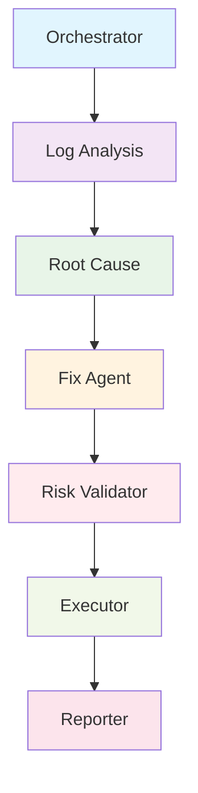

# Resolvix AI Ops - Autonomous DevOps Platform

[](https://github.com/munawarali345/resolvix-ai-autopilo/actions/workflows/ci.yml)
[](https://opensource.org/licenses/MIT)
[](https://pnpm.io/)

## Overview

Resolvix AI Ops AI is an autonomous multi-agent DevOps platform that autonomously monitors 
application health, detects incidents, diagnoses root causes, proposes remediation strategies, 
validates risk, and executes recovery actions with minimal human intervention.

## Architecture



## Multi-Agent Workflow

| Agent | Purpose | Skills | Tools |
|-------|---------|--------|-------|
| **Orchestrator** | Workflow coordination | - | - |
| **Log Analysis** | Extract errors, build timeline, identify patterns | Log Analysis Skill | extractErrors, buildTimeline, groupLogs, extractAffectedServices, dependencyMapper |
| **Root Cause** | Identify probable root cause | Trace Dependencies Skill | - |
| **Fix Agent** | Generate remediation recommendations | Fix Recommendation Skill | searchFixPlaybook, searchRunbook, configurationReader, configurationDiff, serviceInventory |
| **Risk Validator** | Validate remediation safety | Validate Risk Skill | approvalPolicy, maintenanceWindow, impactAssessment, missingValidation |

## Project Structure

```
resolvix-ai/
├── backend/
│   ├── src/
│   │   ├── ai/qwen/                    # Qwen Cloud integration
│   │   ├── agents/                     # AI Agents with skills
│   │   │   ├── detectionAgent/
│   │   │   ├── log-analysisAgent/
│   │   │   ├── orchestratorAgent/
│   │   │   ├── risk-validatorAgent/
│   │   │   ├── fixAgent/
│   │   │   └── root-causeAgent/
│   │   ├── config/                     # Configuration files
│   │   ├── controllers/                # Request handlers
│   │   ├── data/playbookData/          # Knowledge base (playbooks, runbooks)
│   │   ├── langGraph/                  # Workflow graph & nodes
│   │   │   ├── graph/workflow.graph.ts
│   │   │   ├── nodes/
│   │   │   └── state/workflow.state.ts
│   │   ├── lib/                        # Utilities
│   │   ├── middlewares/                # Express middlewares
│   │   ├── models/                     # Database schemas
│   │   ├── routes/                     # API routes
│   │   ├── services/                   # Business logic
│   │   │   ├── agentsServices/
│   │   │   ├── incidentSimulatorServices/
│   │   │   └── agentExecutionServices/
│   │   ├── skills/                     # Agent operational procedures
│   │   │   ├── fixAgentSkills/
│   │   │   ├── riskValidationSkill/
│   │   │   ├── logAnalysisSkills/
│   │   │   └── rootCauseAgentSkills/
│   │   ├── tools/                      # Tool wrappers & executors
│   │   │   ├── fixAgentTools/
│   │   │   ├── logAnalyzerAgentTools/
│   │   │   └── riskValidatorTools/
│   │   ├── types/                      # TypeScript interfaces
│   │   ├── utils/                      # Helper functions
│   │   ├── app.ts
│   │   └── server.ts
│   └── package.json
├── frontend/
│   └── src/
│       ├── app/
│       ├── components/
│       ├── lib/
│       └── types/
├── docs/
│   ├── ARCHITECTURE.md
│   └── PROJECT_STATUS.md
├── .github/
└── README.md
```

## Skill-Based Agent Framework

Each agent follows a structured operational procedure defined in markdown skill files:

```
src/skills/
├── fixAgentSkills/fixRecommendationSkill.md
├── riskValidationSkill/validateRiskSkill.md
├── logAnalysisSkills/logAnalysisSkill.md
└── rootCauseAgentSkills/traceDepandencySkill.md
```

Skills enforce:
- Evidence-based reasoning
- Tool selection strategy
- Safety constraints
- Output validation requirements

## Tool Architecture

### Wrapper Pattern

```
src/tools/
├── fixAgentTools/
│   ├── toolWrappers/     # 5 tools
│   └── toolExecutors/    # Business logic
├── logAnalyzerAgentTools/
│   ├── toolWrappers/     # 5 tools
│   └── toolExecutors/    # Business logic
└── riskValidatorTools/
    ├── toolWrappers/     # 4 tools
    └── toolExecutors/    # Business logic
```

### Scoring Algorithm

Playbook matching uses weighted scoring:
- Root Cause Match: 60 points
- Service Match: 15 points per service (max 30)
- Severity Match: 10 points

## Knowledge Base

### Playbooks (56 Ready-to-Use)
Located in `src/data/playbookData/playbooks.data.ts`

Categories:
- Database Failures (15 playbooks)
- Memory Leaks (10 playbooks)
- API 500 Errors (11 playbooks)
- Deployment Failures (10 playbooks)
- CPU Spikes (10 playbooks)

### Runbooks
Located in `src/data/playbookData/runbook.data.ts`

### Service Inventory
Located in `src/data/playbookData/serviceInventoryData.ts`

## AI Integration

### Qwen Cloud APIs
- **Direct Client**: `src/ai/qwen/qwen.client.ts` - Raw API communication
- **LangChain Model**: `src/ai/qwen/qwen.langchain.ts` - Tool-calling model wrapper

### Configuration (`src/ai/qwen/qwen.config.ts`)
```typescript
QWEN_CONFIG = {
  baseUrl: 'https://dashscope-intl.aliyuncs.com/compatible-mode/v1',
  model: env.QWEN_MODEL,
  temperature: 0,
  maxTokens: 1000
}
```

## Incident Simulation

API endpoints in `src/routes/incident-simulation.routes.ts`:

```bash
# Database Failure
POST /api/simulate/db-failure

# Memory Leak
POST /api/simulate/memory-leak

# API 500 Error
POST /api/simulate/api-500

# Deployment Failure
POST /api/simulate/deployment-failure

# CPU Spike
POST /api/simulate/cpu-spike
```

## Tech Stack

### Backend
- **Framework**: Express.js + TypeScript (ESM)
- **AI Framework**: LangChain + LangGraph
- **Database**: MongoDB (Mongoose)
- **Authentication**: JWT
- **Logging**: Winston

### Frontend
- **Framework**: Next.js 15 (App Router)
- **State Management**: Zustand
- **UI Library**: shadcn/ui
- **Charts**: Recharts

## Quick Start

### Install Dependencies
```bash
pnpm install
```

### Start Backend
```bash
pnpm dev:backend
# Server runs at http://localhost:5000
```

### Start Frontend
```bash
pnpm dev:frontend
# App runs at http://localhost:3000
```

## Demo Flow

```
┌─────────────────┐
│   Sample API    │ POST /api/simulate/db-failure
└───────┬─────────┘
        ▼
┌─────────────────┐
│  LangGraph      │ Workflow Execution
└───────┬─────────┘
        ▼
┌─────────────────┐
│ Orchestrator → Log Analysis → Root Cause → Fix Agent → Risk Validator
└─────────────────┘
```

## Documentation

- `ARCHITECTURE.md` - System diagrams and flow
- `PROJECT_STATUS.md` - Feature status and demo guide

## License

MIT License