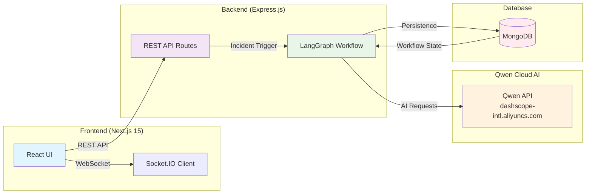

# Resolvix AI Ops - Autonomous DevOps Platform

[](https://github.com/munawarali345/resolvix-ai-autopilo/actions/workflows/ci.yml)
[](https://opensource.org/licenses/MIT)
[](https://pnpm.io/)

## Overview

Resolvix AI Ops is an autonomous multi-agent DevOps platform that monitors application health, detects incidents, diagnoses root causes, proposes remediation strategies, validates risk, and executes recovery actions with minimal human intervention.

## Architecture Diagram



### Agent Workflow Flow

```mermaid
flowchart LR
    A[Incident Triggered] --> B[Orchestrator Node]
    B --> C[Log Analysis Node]
    C --> D[Root Cause Node]
    D --> E[Fix Agent Node]
    E --> F[Risk Validator Node]
    F --> G[Approval Router Node]
    G --> H[Executor Node]
    H --> I[Reporter Node]
    I --> J[Complete Node]
```



## Multi-Agent Workflow

| Agent              | Purpose                                           | Skills                   | Tools                                                                                      |
| ------------------ | ------------------------------------------------- | ------------------------ | ------------------------------------------------------------------------------------------ |
| **Orchestrator**   | Workflow coordination                             | -                        | -                                                                                          |
| **Log Analysis**   | Extract errors, build timeline, identify patterns | Log Analysis Skill       | extractErrors, buildTimeline, groupLogs, extractAffectedServices, dependencyMapper         |
| **Root Cause**     | Identify probable root cause                      | Trace Dependencies Skill | -                                                                                          |
| **Fix Agent**      | Generate remediation recommendations              | Fix Recommendation Skill | searchFixPlaybook, searchRunbook, configurationReader, configurationDiff, serviceInventory |
| **Risk Validator** | Validate remediation safety                       | Validate Risk Skill      | approvalPolicy, maintenanceWindow, impactAssessment, missingValidation                     |
| **Executor**       | Execute approved remediation commands             | Executor Agent Skill     | executeCommand, verifyExecution, rollback, notification                                    |
| **Reporter**       | Generate incident resolution report               | Reporter Agent Skill     | reportFormatter, calculateMetrics, buildTimeline                                           |

## Project Structure

```
resolvix-ai/
├── backend/
│   ├── src/
│   │   ├── ai/qwen/                           # Qwen Cloud integration
│   │   │   ├── qwen.client.ts                 # Direct OpenAI-compatible client
│   │   │   ├── qwen.langchain.ts              # LangChain model wrapper
│   │   │   ├── qwen.config.ts                 # Configuration settings
│   │   │   └── index.ts
│   │   │
│   │   ├── agents/                            # AI Agents with skills
│   │   │   ├── detectionAgent/
│   │   │   ├── log-analysisAgent/
│   │   │   ├── orchestratorAgent/
│   │   │   ├── risk-validatorAgent/
│   │   │   ├── fixAgent/
│   │   │   ├── root-causeAgent/
│   │   │   └── reporterAgent/, executorAgent/
│   │   │
│   │   ├── config/                            # Configuration files
│   │   │   ├── db.ts                          # MongoDB connection
│   │   │   ├── validateEnv.ts                 # Environment validation (Zod)
│   │   │   ├── rateLimiter.ts                 # Rate limiting
│   │   │   └── email.ts                       # Email configuration
│   │   │
│   │   ├── controllers/                     # Request handlers
│   │   │   ├── authControllers/
│   │   │   ├── incidentSimulatorController/
│   │   │   ├── incidentControllers/
│   │   │   ├── agentStatusController/
│   │   │   ├── reporterControllers/
│   │   │   ├── notificationControllers/
│   │   │   ├── dashboardOverview/
│   │   │   └── userControllers/
│   │   │
│   │   ├── data/playbookData/                 # Knowledge base (playbooks, runbooks)
│   │   │   ├── playbooks.data.ts              # 56 remediation playbooks
│   │   │   ├── runbook.data.ts                # Operational runbooks
│   │   │   ├── serviceInventoryData.ts        # Service metadata
│   │   │   ├── configuration.data.ts          # Configuration data
│   │   │   └── configDiff.data.ts             # Configuration changes
│   │   │
│   │   ├── langGraph/                         # Workflow graph & nodes
│   │   │   ├── graph/workflow.graph.ts        # Main workflow orchestration
│   │   │   ├── nodes/                         # Workflow nodes
│   │   │   │   ├── orchestrator.node.ts
│   │   │   │   ├── logAnalysis.node.ts
│   │   │   │   ├── rootCause.node.ts
│   │   │   │   ├── fix.node.ts
│   │   │   │   ├── riskValidator.node.ts
│   │   │   │   ├── approvalRouter.node.ts
│   │   │   │   ├── executor.node.ts
│   │   │   │   ├── reporter.node.ts
│   │   │   │   └── complete.node.ts
│   │   │   ├── state/workflow.state.ts        # Shared state annotations
│   │   │   └── checkPointer/mongo.CheckPointer.ts # MongoDB checkpointing
│   │   │
│   │   ├── lib/                             # Utilities
│   │   │   └── logger.ts                      # Winston logger
│   │   │
│   │   ├── middlewares/                     # Express middlewares
│   │   │   ├── auth.middleware.ts
│   │   │   ├── error.middleware.ts
│   │   │   ├── rate-limit.middleware.ts
│   │   │   └── pagination.middleware.ts
│   │   │
│   │   ├── models/                          # Database schemas
│   │   │   ├── user.model.ts
│   │   │   ├── log.model.ts
│   │   │   ├── report.model.ts
│   │   │   ├── incident.model.ts
│   │   │   ├── agentExecution.model.ts
│   │   │   └── audit.model.ts
│   │   │
│   │   ├── routes/                          # API routes
│   │   │   ├── authRoutes/
│   │   │   ├── incident-simulationRoutes/
│   │   │   ├── incidentRoutes/
│   │   │   ├── dashboardRoutes/
│   │   │   ├── agentStatusRoutes/
│   │   │   ├── notificationRoutes/
│   │   │   ├── reporterRoutes/
│   │   │   └── userRoutes/
│   │   │
│   │   ├── services/                        # Business logic
│   │   │   ├── agentsServices/
│   │   │   │   ├── orchestratorAgentService/
│   │   │   │   ├── logAnalyzerService/
│   │   │   │   ├── rootCauseAgentService/
│   │   │   │   ├── fixAgentService/
│   │   │   │   ├── riskValidationAgentService/
│   │   │   │   ├── executorAgentService/
│   │   │   │   └── reporterAgentService/
│   │   │   ├── incidentSimulatorServices/
│   │   │   ├── agentExecutionServices/
│   │   │   ├── incidentServices/
│   │   │   ├── dashboardServices/
│   │   │   ├── notificationService/
│   │   │   ├── reportServices/
│   │   │   ├── auth.service.ts
│   │   │   ├── email.service.ts
│   │   │   └── token.service.ts
│   │   │
│   │   ├── skills/                          # Agent operational procedures
│   │   │   ├── logAnalysisSkills/logAnalysisSkill.md
│   │   │   ├── fixAgentSkills/fixRecommendationSkill.md
│   │   │   ├── riskValidationSkill/validateRiskSkill.md
│   │   │   ├── rootCauseAgentSkills/traceDepandencySkill.md
│   │   │   ├── reportAgentSkills/reporterAgentSkill.md
│   │   │   └── executorAgentSkills/executorAgentSkill.md
│   │   │
│   │   ├── tools/                           # Tool wrappers & executors
│   │   │   ├── logAnalyzerAgentTools/
│   │   │   │   ├── toolWrappers/
│   │   │   │   └── toolExecutors/
│   │   │   ├── fixAgentTools/
│   │   │   │   ├── toolWrappers/
│   │   │   │   └── toolExecutors/
│   │   │   ├── riskValidatorTools/
│   │   │   │   ├── toolWrappers/
│   │   │   │   └── toolExecutors/
│   │   │   ├── reportAgennt/
│   │   │   │   ├── toolWrappers/
│   │   │   │   └── toolExecutors/
│   │   │   └── executorAgent/
│   │   │       ├── toolWrappers/
│   │   │       ├── toolExecutors/
│   │   │       ├── executecommandtoolshelpers/
│   │   │       ├── rollbackToolHalpers/
│   │   │       └── notificationHelpers/
│   │   │
│   │   ├── types/                           # TypeScript interfaces
│   │   ├── utils/                           # Helper functions
│   │   ├── socket/                          # Socket.IO configuration
│   │   ├── app.ts                           # Express app setup
│   │   └── server.ts                        # Server entry point
│   └── package.json
│
├── frontend/
│   └── src/
│       ├── app/                             # Next.js App Router pages
│       │   ├── (dashboard)/
│       │   │   ├── dashboard/
│       │   │   ├── incidents/
│       │   │   ├── reports/
│       │   │   ├── notifications/
│       │   │   └── layout.tsx
│       │   ├── layout.tsx
│       │   └── page.tsx
│       ├── components/                      # UI Components
│       │   ├── agentStatusTimelime/
│       │   ├── report/
│       │   └── auth/AuthCard.tsx
│       ├── features/                        # Feature components
│       │   ├── incidents/
│       │   └── reports/
│       ├── hooks/                           # React hooks
│       │   ├── useIncidents.ts
│       │   ├── useReports.ts
│       │   ├── useAuth.ts
│       │   └── useSimulation.ts
│       ├── services/                        # API services
│       ├── stores/                          # Zustand state management
│       ├── lib/                             # Utilities
│       │   ├── api/                         # API clients
│       │   ├── socketClient/
│       │   └── listeners/
│       └── types/                           # TypeScript interfaces
│
├── docker-compose.yml                         # Docker orchestration
├── pnpm-workspace.yaml                        # Monorepo configuration
└── README.md
```

## Skill-Based Agent Framework

Each agent follows a structured operational procedure defined in markdown skill files:

```
src/skills/
├── logAnalysisSkills/logAnalysisSkill.md
├── fixAgentSkills/fixRecommendationSkill.md
├── riskValidationSkill/validateRiskSkill.md
├── rootCauseAgentSkills/traceDepandencySkill.md
├── reportAgentSkills/reporterAgentSkill.md
└── executorAgentSkills/executorAgentSkill.md
```

Skills enforce:

- Evidence-based reasoning
- Tool selection strategy
- Safety constraints
- Output validation requirements

## Tool Architecture

### Fix Agent Tools (5)

```
src/tools/fixAgentTools/
├── toolExecutors/
│   ├── searchFixPlaybook.function.ts
│   ├── searchRunbook.function.ts
│   ├── configurationReader.function.ts
│   ├── configDiff.function.ts
│   └── serviceInventory.function.ts
└── toolWrappers/
    ├── searchFixPlaybookToolWrapper.ts
    ├── searchRunbookToolWrapper.ts
    ├── configurationReaderToolWrapper.ts
    ├── configDiffToolWrapper.ts
    └── serviceInventoryToolWrapper.ts
```

### Log Analyzer Tools (5)

```
src/tools/logAnalyzerAgentTools/
├── toolExecutors/
│   ├── extractErrors.ts
│   ├── buildTimeline.ts
│   ├── groupLogs.ts
│   ├── extractAffectedServices.ts
│   └── dependencyMapper.ts
└── toolWrappers/
    ├── extratErrorToolWraper.ts
    ├── buildTimelinetoolwrapper.ts
    ├── groupedLogToolWrapper.ts
    ├── extractAffectedServiceToolWrapper.ts
    └── dependencyMapperToolWrapper.ts
```

### Risk Validator Tools (4)

```
src/tools/riskValidatorTools/
├── toolExecutors/
│   ├── approvalPolicy.function.ts
│   ├── maintenanceWindow.function.ts
│   ├── impactAssessment.function.ts
│   └── missingValidation.function.ts
└── toolWrappers/
    ├── approvalPolicyToolWrapper.ts
    ├── maintenanceWindowToolWrapper.ts
    ├── impactAssessmentToolWrapper.ts
    └── missingValidationToolWrapper.ts
```

### Executor Agent Tools (4)

```
src/tools/executorAgent/
├── toolExecutors/
│   ├── executeCommand.function.ts
│   ├── verifyExecution.function.ts
│   ├── rollback.function.ts
│   └── notification.function.ts
└── toolWrappers/
    ├── executeCommandToolWrapper.ts
    ├── verifyExecutionToolWrapper.ts
    ├── rollbackToolWrapper.ts
    └── notificationToolWrapper.ts
```

### Reporter Agent Tools (3)

```
src/tools/reportAgennt/
├── toolExecutors/
│   ├── reportFormatter.function.ts
│   ├── calculateMetrics.function.ts
│   └── buildTimeline.function.ts
└── toolWrappers/
    ├── reportFormatterToolWrapper.ts
    ├── metricsToolWrapper.ts
    └── timelineToolWrapper.ts
```

### Scoring Algorithm

Playbook matching uses weighted scoring:

| Criteria         | Points                         |
| ---------------- | ------------------------------ |
| Root Cause Match | 60 points                      |
| Service Match    | 15 points per service (max 30) |
| Severity Match   | 10 points                      |

## Knowledge Base

### Playbooks (56 Ready-to-Use)

Located in `src/data/playbookData/playbooks.data.ts`

| Category            | Count |
| ------------------- | ----- |
| Database Failures   | 15    |
| Memory Leaks        | 10    |
| API 500 Errors      | 11    |
| Deployment Failures | 10    |
| CPU Spikes          | 10    |

### Runbooks

Located in `src/data/playbookData/runbook.data.ts`

### Service Inventory

Located in `src/data/playbookData/serviceInventoryData.ts`

## AI Integration

### Qwen Cloud Configuration

```typescript
// src/ai/qwen/qwen.config.ts
export const QWEN_CONFIG = {
  baseUrl: 'https://dashscope-intl.aliyuncs.com/compatible-mode/v1',
  apiKey: env.DASHSCOPE_API_KEY,
  model: env.QWEN_MODEL,
  temperature: 0,
  topP: 0.8,
  maxTokens: 3000,
  timeout: 30000,
} as const;
```

Required Environment Variables (`.env`):

```bash
# Qwen Cloud API
DASHSCOPE_API_KEY=sk-...
QWEN_MODEL=qwen-plus

# MongoDB
MONGO_URI=mongodb://localhost:27017/resolvix-ai

# JWT
JWT_SECRET=your-secret-key
```

## API Endpoints

### Authentication

```
POST   /api/auth/login
POST   /api/auth/register
POST   /api/auth/refresh
POST   /api/auth/logout
```

### Incident Simulation

```
POST   /api/simulate/db-failure         # Database failure simulation
POST   /api/simulate/memory-leak        # Memory leak simulation
POST   /api/simulate/api-500-error      # API 500 error simulation
POST   /api/simulate/deployment-failure # Deployment failure simulation
POST   /api/simulate/cpu-spike          # CPU spike simulation
```

### Incidents

```
GET    /api/incidents                   # List incidents (paginated)
GET    /api/incidents/:incidentId       # Get incident by ID
PATCH  /api/incidents/:incidentId/approve   # Approve incident
PATCH  /api/incidents/:incidentId/reject    # Reject incident
PATCH  /api/incidents/:threadId/resume      # Developer resume
```

### Agent Status

```
GET    /api/agents/status/:incidentId   # Get agent execution status
```

### Reports

```
GET    /api/reports                     # List all reports
GET    /api/reports/:id                 # Get report by ID
```

### Dashboard

```
GET    /api/dashboard                   # Dashboard overview
GET    /api/dashboard/health-metrics    # Health metrics
GET    /api/dashboard/charts            # Chart data
```

### Notifications

```
GET    /api/notification                # Get notifications
PATCH  /api/notification/:id/read       # Mark as read
DELETE /api/notification/:id           # Delete notification
```

## Tech Stack

### Backend

| Technology       | Purpose                            |
| ---------------- | ---------------------------------- |
| Express.js       | Web framework                      |
| TypeScript (ESM) | Type-safe JavaScript               |
| LangChain        | AI model integration               |
| LangGraph        | Multi-agent workflow orchestration |
| MongoDB          | Database (Mongoose ODM)            |
| Mongoose         | Object Document Mapping            |
| JWT              | Authentication                     |
| Winston          | Structured logging                 |
| Socket.IO        | Real-time WebSocket                |
| Zod              | Schema validation                  |

### Frontend

| Technology       | Purpose                      |
| ---------------- | ---------------------------- |
| Next.js 15       | React framework (App Router) |
| TypeScript       | Type safety                  |
| React 19         | UI library                   |
| Tailwind CSS 4   | Styling                      |
| shadcn/ui        | Component library            |
| Zustand          | State management             |
| React Query 5    | Server state management      |
| Recharts         | Charts and visualizations    |
| Socket.IO Client | WebSocket connection         |

## Commands

### Setup

```bash
# Install all dependencies
pnpm install

# Run lint check
pnpm lint

# Format code
pnpm format
```

### Development

```bash
# Start backend dev server (port 5000)
pnpm dev:backend

# Start frontend dev server (port 3000)
pnpm dev:frontend

# Build backend
pnpm --filter resolvix-ai-backend build

# Build frontend
pnpm --filter resolvix-ai-frontend build
```

### Docker

```bash
# Start all services with Docker
docker-compose up -d

# Stop all services
docker-compose down

# View logs
docker-compose logs -f
```

### Testing API

```bash
# Database Failure Simulation
curl -X POST http://localhost:5000/api/simulate/db-failure

# Memory Leak Simulation
curl -X POST http://localhost:5000/api/simulate/memory-leak

# API 500 Error Simulation
curl -X POST http://localhost:5000/api/simulate/api-500-error
```

## Docker Configuration

```yaml
# docker-compose.yml services
services:
  mongodb:
    image: mongo:7.0
    ports:
      - '27017:27017'

  backend:
    build:
      context: .
      dockerfile: backend/Dockerfile
    ports:
      - '5000:5000'
    depends_on:
      - mongodb

  frontend:
    build:
      context: .
      dockerfile: frontend/Dockerfile
    ports:
      - '3000:3000'
    depends_on:
      - backend
```

## Demo Flow

```
┌─────────────────┐
│   Sample API    │ POST /api/simulate/db-failure
└───────┬─────────┘
        ▼
┌─────────────────┐
│   Orchestrator  │ Workflow initialization
└───────┬─────────┘
        ▼
┌─────────────────┐
│   Log Analysis  │ Extract errors, build timeline
└───────┬─────────┘
        ▼
┌─────────────────┐
│   Root Cause    │ Identify root cause
└───────┬─────────┘
        ▼
┌─────────────────┐
│   Fix Agent     │ Search playbooks, recommend fix
└───────┬─────────┘
        ▼
┌─────────────────┐
│ Risk Validator  │ Validate risk & approval
└───────┬─────────┘
        ▼
┌─────────────────┐
│    Executor     │ Execute remediation commands
└───────┬─────────┘
        ▼
┌─────────────────┐
│    Reporter     │ Generate incident report
└────────┬────────┘
```

## Project Stats

| Metric          | Count |
| --------------- | ----- |
| Agents          | 7     |
| Skills          | 6     |
| Tools           | 19    |
| Playbooks       | 56    |
| Database Models | 6     |
| Services        | 15+   |
| Controllers     | 12+   |
| API Routes      | 7     |

## Documentation

| File                | Description                   |
| ------------------- | ----------------------------- |
| `README.md`         | Project overview and commands |
| `ARCHITECTURE.md`   | System architecture details   |
| `PROJECT_STATUS.md` | Feature status & demo guide   |
| `SETUP.md`          | Setup instructions            |

## License

MIT License
